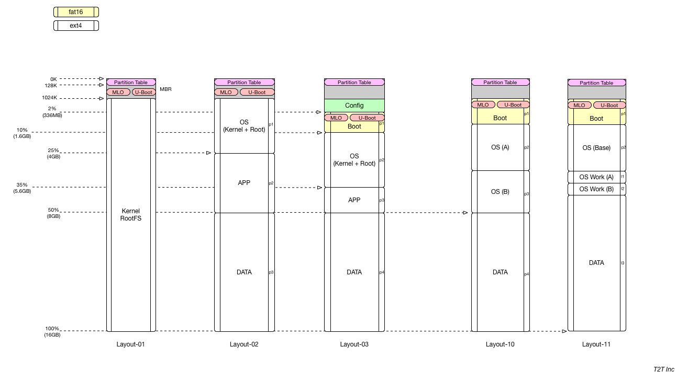

## Summary

The part `toe2-base` is used to modify archive image by install ToE v2 profiles/yapps/iapps with **layout-03**. 
.

In the future, the part `toe3-base` is used for ToE v3 with partition **layout-11**.
